# VisionFlow 项目完整功能调用流程图

> **项目**: VisionFlow -- 计算机视觉可视化工作流编辑器
> **技术栈**: Python 3 + PyQt5 + OpenCV + NumPy
> **分析日期**: 2026-06-16

---

## 目录

1. [项目架构概览](#1-项目架构概览)
2. [总体架构流程图](#2-总体架构流程图)
3. [启动流程](#3-启动流程)
4. [主窗口工具栏按钮流程图](#4-主窗口工具栏按钮流程图)
5. [菜单栏操作流程图](#5-菜单栏操作流程图)
6. [节点编辑器流程图](#6-节点编辑器流程图)
7. [工作流执行流程图（核心路径）](#7-工作流执行流程图核心路径)
8. [起始页流程图](#8-起始页流程图)
9. [工具箱面板流程图](#9-工具箱面板流程图)
10. [属性面板与设置对话框流程图](#10-属性面板与设置对话框流程图)
11. [事件系统流程图](#11-事件系统流程图)
12. [连续执行帧率控制](#12-连续执行帧率控制)
13. [运行全部模式](#13-运行全部模式)
14. [UI控件与信号槽完整清单](#14-ui控件与信号槽完整清单)
15. [函数调用表](#15-函数调用表)
16. [PlantUML 代码](#16-plantuml-代码)

---

## 1. 项目架构概览

```
main.py                           -- 启动入口 (argparse -> AppContext -> GUI/CLI)
├── requirements.txt              -- Python 依赖清单
├── app_config.json               -- 应用配置 (窗口布局/首选项)
├── theme_config.json             -- 主题配置 ("dark")
├── templates.json                -- 全局模板索引
├── demo.json                     -- 演示工作流项目
├── 新建项目.json                  -- 新建项目默认模板
├── 文件说明.md                    -- 中文文件说明文档
│
├── core/                         -- 领域逻辑层 (无GUI依赖)
│   ├── __init__.py
│   ├── workflow.py               -- 工作流引擎 (拓扑排序+层级执行)
│   ├── events.py                 -- 事件总线 (发布/订阅)
│   ├── commands.py               -- 命令栈 (撤销/重做 CommandStack)
│   ├── node_base.py              -- 节点基类/端口/连线数据模型
│   ├── registry.py               -- 节点类型注册表
│   ├── project.py                -- 项目服务 (JSON 序列化/反序列化)
│   ├── conditions.py             -- 条件评估逻辑
│   ├── constants.py              -- 应用常量/分组元数据
│   ├── data_packet.py            -- 节点间数据包
│   ├── interfaces.py             -- 抽象接口/协议
│   ├── ioc.py                    -- 依赖注入容器
│   ├── node_group.py             -- 节点分组管理器
│   ├── plugin_manager.py         -- 插件/节点发现
│   └── result_presenter.py       -- 结果展示逻辑
│
├── services/                     -- 应用服务层 (桥接 core ↔ gui)
│   ├── __init__.py
│   ├── app_context.py            -- 应用上下文/DI 容器
│   ├── workflow_runner.py        -- 后台线程工作流执行器
│   └── node_service.py           -- 节点管理服务
│
├── gui/                          -- 用户界面层 (PyQt5)
│   ├── __init__.py
│   ├── main_window.py            -- 主窗口 (工具栏/菜单/面板组装)
│   ├── start_page.py             -- 起始页 (新建/打开/最近项目)
│   ├── toolbox_panel.py          -- 工具箱面板 (树形/网格/窄模式)
│   ├── property_panel.py         -- 属性编辑面板 (Property + EditorRegistry)
│   ├── result_panel.py           -- 结果面板 (执行历史/节点结果)
│   ├── image_viewer.py           -- 图像查看器面板
│   ├── log_panel.py              -- 日志输出面板
│   ├── help_panel.py             -- 帮助面板
│   ├── dock_manager.py           -- 可停靠面板管理器
│   ├── filter_box.py             -- 节点过滤器/搜索
│   ├── flow_resource_panel.py    -- 流程资源面板 (缩略图)
│   ├── message_center.py         -- 通知/消息中心
│   ├── presenters.py             -- MVP 展示器
│   ├── theme.py                  -- 主题管理器
│   ├── theme_data.py             -- 主题颜色数据
│   ├── font_icons.py             -- 图标字体 (FontIconButton 等)
│   ├── guide_overlay.py          -- 用户引导覆盖层
│   ├── color_picker.py           -- 颜色选择器对话框
│   ├── condition_editor.py       -- 条件编辑器对话框
│   ├── crop_dialog.py            -- 裁剪对话框
│   ├── img_template_manager.py   -- 图像模板管理器
│   ├── roi_editor.py             -- ROI 编辑器
│   ├── template_dialog.py        -- 模板选择/管理对话框
│   ├── widgets/                  -- 可重用小部件
│   │   ├── __init__.py
│   │   ├── grid_splitter_box.py  -- 网格分割器布局组件
│   │   └── node_list_view.py     -- 节点列表视图
│   └── node_editor/              -- 节点图编辑器子包
│       ├── __init__.py
│       ├── editor_widget.py      -- 编辑器控件 (QGraphicsView + 工具栏 + 小地图)
│       ├── scene.py              -- 场景管理 (节点/连线的 CRUD)
│       ├── node_item.py          -- 节点图形项
│       ├── edge_item.py          -- 连线图形项
│       ├── socket_item.py        -- 端口/插座图形项
│       └── link_drawer.py        -- 连线绘制策略
│
├── nodes/                        -- 视觉处理节点实现 (~120 节点)
│   ├── __init__.py
│   ├── sources/                  -- 图像源节点
│   │   ├── __init__.py
│   │   ├── camera_source.py      -- 摄像头源
│   │   ├── image_file_source.py  -- 图像文件源
│   │   ├── video_file_source.py  -- 视频文件源
│   │   └── zoo_sources.py        -- 图像 Zoo 测试源
│   ├── preprocessings/           -- 图像预处理
│   │   ├── __init__.py
│   │   ├── arithmetic.py         -- 算术运算
│   │   ├── bitwise_not.py        -- 按位取反
│   │   ├── cvt_color.py          -- 色彩空间转换
│   │   ├── flip.py               -- 翻转
│   │   ├── normalize.py          -- 归一化
│   │   ├── repeat.py             -- 重复/平铺
│   │   ├── resize.py             -- 调整大小
│   │   ├── rotate.py             -- 旋转
│   │   ├── split_bgr.py          -- 拆分 BGR 通道
│   │   └── threshold.py          -- 阈值处理
│   ├── blurs/                    -- 滤波/模糊模块
│   │   ├── __init__.py
│   │   ├── blur.py               -- 均值模糊
│   │   ├── gaussian_blur.py      -- 高斯模糊
│   │   ├── edge_blur.py          -- 边缘保留模糊
│   │   ├── detail_enhance.py     -- 细节增强
│   │   └── pencil_sketch.py      -- 铅笔画效果
│   ├── takeoffs/                 -- 图像分割与提取
│   │   ├── __init__.py
│   │   ├── bitwise_and.py        -- 按位与
│   │   ├── crop.py               -- 裁剪
│   │   ├── draw_contours.py      -- 绘制轮廓
│   │   ├── hsv_inrange.py        -- HSV 范围提取
│   │   ├── roi_map_back.py       -- ROI 映射回原图
│   │   └── seamless_clone_bg.py  -- 无缝克隆背景
│   ├── morphology/               -- 形态学运算
│   │   ├── __init__.py
│   │   ├── morph_base.py         -- 形态学基类
│   │   ├── dilate.py             -- 膨胀
│   │   ├── erode.py              -- 腐蚀
│   │   ├── open.py               -- 开运算
│   │   ├── close.py              -- 闭运算
│   │   ├── gradient.py           -- 形态学梯度
│   │   ├── top_hat.py            -- 顶帽
│   │   └── black_hat.py          -- 黑帽
│   ├── conditions/               -- 逻辑/条件模块
│   │   ├── __init__.py
│   │   ├── condition_branch.py   -- 条件分支
│   │   ├── pixel_threshold.py    -- 像素计数阈值
│   │   └── data_collector.py     -- 数据收集器
│   ├── template_matchings/       -- 模板匹配模块
│   │   ├── __init__.py
│   │   ├── template_base.py      -- 模板匹配基类
│   │   ├── template_matching.py  -- OpenCV 模板匹配
│   │   ├── chamfer_matching.py   -- 倒角匹配 (DLL 包装)
│   │   ├── edge_matching.py      -- 边缘匹配 (DLL 包装)
│   │   ├── ncc_matching.py       -- NCC 匹配 (DLL 包装)
│   │   ├── sad_matching.py       -- SAD 匹配 (DLL 包装)
│   │   ├── shape_context_matching.py -- 形状上下文匹配 (DLL 包装)
│   │   ├── sift_matching.py      -- SIFT 特征匹配
│   │   ├── surf_matching.py      -- SURF 特征匹配
│   │   ├── orb_matching.py       -- ORB 特征匹配
│   │   ├── hsv_blob.py           -- HSV 斑点匹配
│   │   ├── xfeat_match.py        -- XFeat 学习型匹配
│   │   └── demo.py               -- 演示匹配节点
│   ├── detectors/                -- 对象检测器
│   │   ├── __init__.py
│   │   ├── detector_base.py      -- 检测器基类
│   │   ├── find_contours.py      -- 查找轮廓
│   │   ├── canny.py              -- Canny 边缘检测
│   │   ├── hough_lines.py        -- 霍夫线检测
│   │   ├── hough_lines_p.py      -- 概率霍夫线检测
│   │   ├── blob_detector.py      -- 斑点检测器
│   │   ├── render_blobs.py       -- 渲染斑点
│   │   └── qr_code.py            -- QR 码检测/解码
│   ├── features/                 -- 特征提取
│   │   ├── __init__.py
│   │   ├── feature_base.py       -- 特征提取器基类
│   │   ├── fast.py               -- FAST 角点检测
│   │   ├── star.py               -- STAR 角点检测
│   │   ├── mser.py               -- MSER 区域检测
│   │   ├── kaze.py               -- KAZE 特征
│   │   ├── akaze.py              -- AKAZE 特征
│   │   ├── brisk.py              -- BRISK 特征
│   │   ├── freak.py              -- FREAK 描述符
│   │   └── homography.py         -- 单应性估计
│   ├── outputs/                  -- 结果输出
│   │   ├── __init__.py
│   │   ├── output_base.py        -- 输出基类
│   │   ├── ok_output.py          -- OK/通过输出
│   │   ├── ng_output.py          -- NG/失败输出
│   │   └── show_outputs.py       -- 显示结果
│   ├── onnx/                     -- ONNX 深度学习节点
│   │   ├── __init__.py
│   │   ├── onnx_base.py          -- ONNX 推理基类
│   │   ├── onnx_infer.py         -- 通用 ONNX 推理
│   │   ├── onnx_cls.py           -- ONNX 分类
│   │   ├── onnx_bbox.py          -- ONNX 边界框检测
│   │   ├── onnx_seg.py           -- ONNX 分割
│   │   ├── yolov5.py             -- YOLOv5 目标检测
│   │   ├── yolov5_face.py        -- YOLOv5 人脸检测
│   │   ├── age_infer.py          -- 年龄推断
│   │   ├── gender_cls.py         -- 性别分类
│   │   ├── human_semseg.py       -- 人体语义分割
│   │   ├── defect_box.py         -- 缺陷检测
│   │   ├── detection_utils.py    -- 检测工具函数
│   │   └── dnn_interface.py      -- DNN 接口
│   ├── network/                  -- 网络通信节点
│   │   ├── __init__.py
│   │   ├── modbus_base.py        -- Modbus 基类
│   │   ├── modbus_read.py        -- Modbus 读保持寄存器
│   │   ├── modbus_write.py       -- Modbus 写单个寄存器
│   │   ├── modbus_multi_write.py -- Modbus 写多个寄存器
│   │   ├── modbus_coil_read.py   -- Modbus 读线圈
│   │   ├── modbus_coil_write.py  -- Modbus 写单个线圈
│   │   ├── modbus_discrete_input.py  -- Modbus 读离散输入
│   │   └── modbus_input_register.py  -- Modbus 读输入寄存器
│   ├── others/                   -- 其他处理节点
│   │   ├── __init__.py
│   │   ├── haar_cascade.py       -- Haar 级联分类器
│   │   ├── lbp_cascade.py        -- LBP 级联分类器
│   │   ├── histogram.py          -- 直方图计算
│   │   ├── hog.py                -- HOG 描述符
│   │   ├── svm.py                -- SVM 分类器
│   │   ├── stitching.py          -- 图像拼接
│   │   ├── seamless_clone.py     -- 无缝克隆
│   │   ├── warp_affine.py        -- 仿射变换
│   │   ├── warp_perspective.py   -- 透视变换
│   │   ├── subdiv2d.py           -- Delaunay 三角剖分
│   │   └── dnn_superres.py       -- DNN 超分辨率
│   ├── video/                    -- 视频处理
│   │   ├── __init__.py
│   │   └── video_nodes.py        -- 视频处理节点
│   ├── modules/                  -- 高级/学习模块
│   │   ├── __init__.py
│   │   ├── model.py              -- 模型定义
│   │   ├── lighterglue.py        -- LightGlue 匹配器
│   │   ├── xfeat.py              -- XFeat 特征提取
│   │   ├── interpolator.py       -- 插值工具
│   │   ├── dataset/              -- 数据集处理
│   │   │   ├── __init__.py
│   │   │   ├── augmentation.py   -- 数据增强
│   │   │   ├── download.py       -- 数据集下载
│   │   │   └── megadepth/         -- MegaDepth 数据集
│   │   │       ├── __init__.py
│   │   │       ├── megadepth.py
│   │   │       ├── megadepth_warper.py
│   │   │       └── utils.py
│   │   ├── eval/                 -- 评估指标
│   │   │   ├── __init__.py
│   │   │   ├── megadepth1500.py
│   │   │   └── scannet1500.py
│   │   └── training/             -- 训练脚本
│   │       ├── __init__.py
│   │       ├── losses.py
│   │       ├── train.py
│   │       └── utils.py
│   ├── dll/                      -- 预编译 C++ DLL 包装
│   │   ├── __init__.py
│   │   ├── vision_dll.py         -- DLL 加载器/包装器
│   │   ├── chamfer_match.dll     -- 倒角匹配 DLL
│   │   ├── edge_match.dll        -- 边缘匹配 DLL
│   │   ├── ncc_match.dll         -- NCC 匹配 DLL
│   │   ├── sad_match.dll         -- SAD 匹配 DLL
│   │   ├── shape_context.dll     -- 形状上下文匹配 DLL
│   │   └── opencv_world4130.dll  -- OpenCV DLL
│   └── third_party/              -- 第三方集成
│       ├── __init__.py
│       └── alike_wrapper.py      -- ALIKE 关键点包装器
│
├── assets/                       -- 静态资源
│   ├── icons/
│   │   ├── logo.ico              -- 应用图标
│   │   └── logo.png              -- 应用图标 (PNG)
│   ├── images/                   -- 示例/测试图像 (~25+ 张)
│   │   ├── test/                 -- 测试图像集
│   │   │   ├── Box.png
│   │   │   ├── BoxInScene.png
│   │   │   ├── Circle.png
│   │   │   ├── CVMorph.png
│   │   │   ├── Lenna.png
│   │   │   ├── Lenna511.png
│   │   │   ├── Pentagon.png
│   │   │   ├── Shapes.png
│   │   │   ├── match1.png
│   │   │   ├── match2.png
│   │   │   ├── penguin1.png
│   │   │   ├── penguin1b.png
│   │   │   ├── penguin2.png
│   │   │   ├── tsukuba_left.png
│   │   │   ├── tsukuba_right.png
│   │   │   ├── Balloon.png
│   │   │   ├── 16bit.png
│   │   │   ├── box.png
│   │   │   └── box_in_scene.png
│   │   └── Squares/
│   │       ├── pic1.png
│   │       ├── pic2.png
│   │       ├── pic3.png
│   │       ├── pic4.png
│   │       ├── pic5.png
│   │       └── pic6.png
│   ├── models/                   -- 预训练模型
│   │   ├── age_efficientnet_b2.onnx
│   │   ├── gender_efficientnet_b2.onnx
│   │   ├── human_segmentation_pphumanseg_2023mar.onnx
│   │   ├── yolov5s.onnx
│   │   ├── yolov5s-face.onnx
│   │   ├── lightglue.pth
│   │   ├── xfeat.pt
│   │   ├── xfeat-lighterglue.pt
│   │   ├── lable.txt
│   │   └── lable_zh_cn.txt
│   └── projects/                 -- 示例工作流项目
│       ├── changzhou.json
│       ├── example-blurs.json
│       ├── example-conditions.json
│       ├── example-detection.json
│       ├── example-features.json
│       ├── example-hsvmatching.json
│       ├── example-morphology.json
│       ├── example-multi-diagram.json
│       ├── example-preprocessings.json
│       └── example-sources.json
│
├── templates/                    -- 工作流模板
│   └── 魔术贴.json
│
├── docs/                         -- 项目文档
│   ├── readme.md
│   ├── property.md
│   ├── 流程图.md
│   ├── 自定义节点.md
│   └── assets/                   -- 文档截图 (~30 张)
│       ├── image-*.png           -- (30+ 截图文件)
│       └── ...
│
└── tests/                        -- 测试
    ├── test_execution_state.py
    └── test_gui_execute.py
```

---

## 2. 总体架构流程图

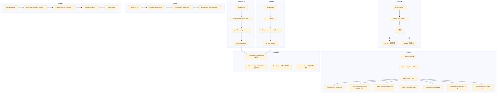

---

## 3. 启动流程

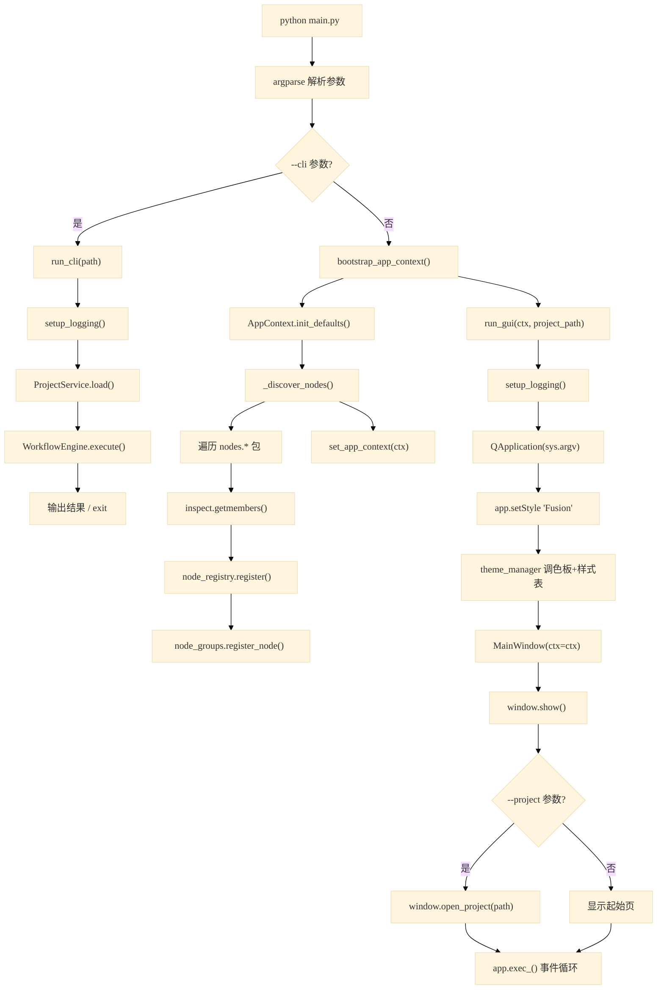

### 3.1 MainWindow.__init__ 初始化细节

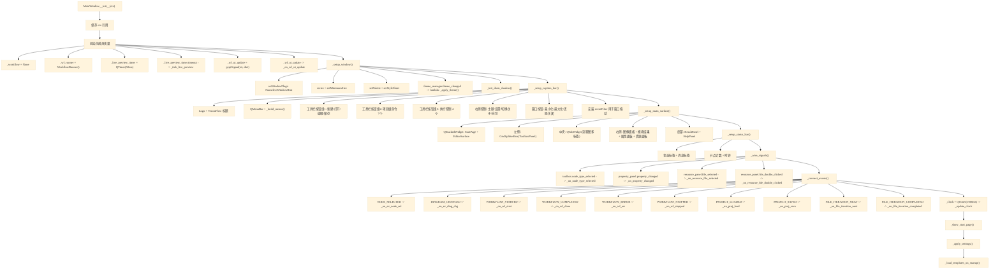

---

## 4. 主窗口工具栏按钮流程图

### 4.1 项目操作按钮 (新建/打开/保存)

```mermaid
%%{init: {"theme":"base", "themeVariables": {"fontSize":"16px","fontFamily":"Microsoft YaHei, sans-serif"}}}%%
graph TD
    subgraph NewProject["新建项目"]
        U1["用户点击「新建项目」"] --> S1["FontIconButton::clicked"]
        S1 --> F1["MainWindow._on_new_project"]
        F1 --> F1a["project_service.new_project()"]
        F1a --> F1b["创建 ProjectItem + 默认 DiagramData"]
        F1 --> F1c["_bind_project_diagram(project)"]
        F1c --> F1d["_refresh_diagram_tabs(project)"]
        F1d --> F1e["遍历 project.diagrams"]
        F1e --> F1f["_create_diagram_page(diagram)"]
        F1f --> F1g["创建 DiagramEditorWidget"]
        F1g --> F1h["_wire_diagram_editor(editor)"]
        F1h --> F1i["editor.bind_workflow(diagram.workflow)"]
        F1c --> F1j["_show_editor()"]
        F1j --> F1k["QStackedWidget 切换到编辑器"]
        F1c --> F1l["_sync_proj_labels(project)"]
        F1l --> F1m["更新标题栏 + 窗口标题"]
        F1 --> F1n["_log_panel.info('新建项目')"]
    end

    subgraph OpenProject["打开项目"]
        U2["用户点击「打开项目」"] --> S2["FontIconButton::clicked"]
        S2 --> F2["MainWindow._on_open_project"]
        F2 --> F2a["QFileDialog.getOpenFileName()"]
        F2a --> F2b["_open_project(path)"]
        F2b --> F2c{"文件存在?"}
        F2c -->|"否"| F2d["project_service.remove_recent() + QMessageBox.warning"]
        F2c -->|"是"| F2e["project_service.load(path)"]
        F2e --> F2f["ProjectService.load: 解析 JSON"]
        F2f --> F2g["WorkflowEngine.from_dict()"]
        F2e --> F2h["_bind_project_diagram(project)"]
        F2e --> F2i["_log_panel.success()"]
    end

    subgraph SaveProject["保存项目"]
        U3["用户点击「保存项目」"] --> S3["FontIconButton::clicked"]
        S3 --> F3["MainWindow._on_save_project"]
        F3 --> F3a{"project.file_path 存在?"}
        F3a -->|"是"| F3b["_sync_workflow_to_project()"]
        F3b --> F3c["遍历所有图表标签页"]
        F3c --> F3d["editor.save_to_workflow()"]
        F3d --> F3e["DiagramScene.save_to_workflow()"]
        F3e --> F3f["保存节点位置+连线到 WorkflowEngine"]
        F3b --> F3g["project_service.save(project)"]
        F3g --> F3h["WorkflowEngine.to_dict() + JSON 写入"]
        F3a -->|"否"| F3i["_on_save_as_project()"]
    end

    subgraph SaveAsProject["另存为项目"]
        U4["用户点击菜单「另存为」"] --> S4["QAction::triggered"]
        S4 --> F4["MainWindow._on_save_as_project"]
        F4 --> F4a["QFileDialog.getSaveFileName()"]
        F4a --> F4b["project.file_path = path"]
        F4b --> F4c["_sync_workflow_to_project()"]
        F4c --> F4d["project_service.save_as(project, path)"]
    end
```

### 4.2 流程图操作按钮 (新建/重复/模板/删除/运行模式)

```mermaid
%%{init: {"theme":"base", "themeVariables": {"fontSize":"16px","fontFamily":"Microsoft YaHei, sans-serif"}}}%%
graph TD
    subgraph AddDiagram["新建流程图"]
        UA["用户点击「新建流程图」"] --> SA["FontIconButton::clicked"]
        SA --> FA["MainWindow._on_add_diagram"]
        FA --> FA1{"project 为空?"}
        FA1 -->|"是"| FA2["project_service.new_project()"]
        FA1 -->|"否"| FA3["_sync_workflow_to_project()"]
        FA3 --> FA4["project.add_diagram()"]
        FA4 --> FA5["_refresh_diagram_tabs(project)"]
        FA5 --> FA6["_log_panel.info()"]
    end

    subgraph DuplicateDiagram["重复流程图"]
        UB["用户点击「重复流程图」"] --> SB["FontIconButton::clicked"]
        SB --> FB["MainWindow._on_duplicate_diagram"]
        FB --> FB1["_sync_workflow_to_project()"]
        FB1 --> FB2["project.duplicate_diagram()"]
        FB2 --> FB3["深拷贝 DiagramData"]
        FB3 --> FB4["_refresh_diagram_tabs()"]
    end

    subgraph TemplateAdd["从模板添加"]
        UC["用户点击「从模板添加」"] --> SC["FontIconButton::clicked"]
        SC --> FC["MainWindow._on_add_from_template"]
        FC --> FC1{"project.templates 为空?"}
        FC1 -->|"是"| FC2["QMessageBox.information 提示"]
        FC1 -->|"否"| FC3["TemplateManagerDialog(project).exec_()"]
        FC3 --> FC4{"dlg.added_diagram?"}
        FC4 -->|"是"| FC5["_refresh_diagram_tabs()"]
    end

    subgraph TemplateManage["模板管理"]
        UD["用户点击「模板管理」"] --> SD["FontIconButton::clicked"]
        SD --> FD["MainWindow._on_manage_templates"]
        FD --> FD1["TemplateManagerDialog(project).exec_()"]
        FD1 --> FD2["_persist_templates()"]
        FD2 --> FD3["project_service.save_templates()"]
    end

    subgraph SaveAsTemplate["另存为模板"]
        UE["用户点击「另存为模板」"] --> SE["FontIconButton::clicked"]
        SE --> FE["MainWindow._on_save_as_template"]
        FE --> FE1{"节点数 == 0?"}
        FE1 -->|"是"| FE2["QMessageBox.question 确认"]
        FE1 -->|"否"| FE3["QInputDialog.getText 输入名称"]
        FE3 --> FE4["_sync_workflow_to_project()"]
        FE4 --> FE5["project.save_diagram_as_template()"]
        FE5 --> FE6["_persist_templates()"]
    end

    subgraph DeleteDiagram["删除流程图"]
        UF["用户点击「删除流程图」"] --> SF["FontIconButton::clicked"]
        SF --> FF["MainWindow._on_delete_diagram"]
        FF --> FF1["_sync_workflow_to_project()"]
        FF1 --> FF2["project.delete_selected_diagram()"]
        FF2 -->|"成功"| FF3["_refresh_diagram_tabs()"]
        FF2 -->|"失败"| FF4["_log_panel.warning('至少保留一个')"]
    end

    subgraph CycleRunMode["运行模式切换"]
        UG["用户点击「运行模式」"] --> SG["FontIconButton::clicked"]
        SG --> FG["MainWindow._on_cycle_run_mode"]
        FG --> FG1["读取 workflow.flowable_mode"]
        FG1 --> FG2["NODE -> LINK -> PORT -> NODE 循环"]
        FG2 --> FG3["_diagram_status_strip.set_status()"]
    end
```

### 4.3 运行控制按钮 (单次/连续/停止/重置)

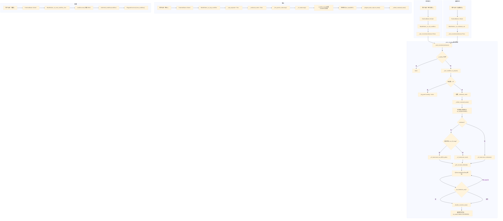

### 4.4 窗口控制按钮 (主题/设置/窗口操作)

```mermaid
%%{init: {"theme":"base", "themeVariables": {"fontSize":"16px","fontFamily":"Microsoft YaHei, sans-serif"}}}%%
graph TD
    subgraph ThemeDialog["颜色主题对话框"]
        U13["用户点击「颜色主题」"] --> S13["FontIconButton::clicked"]
        S13 --> F13["_on_show_theme_dialog"]
        F13 --> F13a["ThemePickerDialog.show()"]
    end

    subgraph ThemeToggle["明暗切换"]
        U14["用户点击「亮度切换」"] --> S14["FontIconToggleButton::toggled"]
        S14 --> F14["_on_toggle_theme"]
        F14 --> F14a["theme_manager.toggle()"]
        F14a --> F14b["theme_changed 信号发出"]
        F14b --> F14c["_apply_theme: 全局 QPalette + StyleSheet 刷新"]
        F14c --> F14d["所有 _refresh_qss 回调被触发"]
    end

    subgraph SettingsDialog["设置对话框"]
        U15["用户点击「设置」"] --> S15["FontIconButton::clicked"]
        S15 --> F15["_on_open_settings"]
        F15 --> F15a["_SettingsDialog(parent=self)"]
        F15a --> F15b["_setup_ui: 3个Tab + 按钮"]
        F15b --> F15c["_build_theme_tab: 主题卡片"]
        F15b --> F15d["_build_basic_tab: QCheckBox x3"]
        F15b --> F15e["_build_display_tab: QCheckBox x1"]
        F15a --> F15f["_load_settings: 从 app_config.json"]
        F15a --> F15g["dialog.exec_()"]
        F15g -->|"确定"| SET_OK["accept() -> _save_settings()"]
        F15g -->|"取消"| SET_CANCEL["_on_cancel: 恢复原主题"]
        F15g -->|"恢复默认"| SET_DEFAULT["_on_restore_default: 重置所有值"]
    end

    subgraph ThemeCardClick["主题卡片即时预览"]
        TH1["用户点击主题卡片"] --> TH2["card.mousePressEvent = lambda"]
        TH2 --> TH3["_on_theme_select(theme_id)"]
        TH3 --> TH4["theme_manager.set_theme(theme_id)"]
        TH4 --> TH5["theme_changed 信号"]
        TH5 --> TH6["全局 QPalette + StyleSheet 刷新"]
    end

    subgraph WindowOps["窗口操作"]
        U16["最小化"] --> S16a["QPushButton::clicked"]
        S16a --> F16a["self.showMinimized()"]
        U17["最大化/还原"] --> S17a["QPushButton::clicked"]
        S17a --> F17a["_toggle_max()"]
        F17a --> F17b["showNormal() / showMaximized()"]
        U18["关闭"] --> S18a["QPushButton::clicked"]
        S18a --> F18a["_on_close_window"]
        F18a --> F18b["closeEvent: 保存 QSettings"]
        F18b --> F18c["_sync_workflow_to_project()"]
        F18c --> F18d["保存窗口/面板尺寸到 QSettings"]
    end
```

---

## 5. 菜单栏操作流程图

```mermaid
%%{init: {"theme":"base", "themeVariables": {"fontSize":"16px","fontFamily":"Microsoft YaHei, sans-serif"}}}%%
graph TD
    subgraph FileMenu["文件菜单"]
        MF1["新建项目 Ctrl+N"] --> MF1a["_on_new_project"]
        MF2["打开项目 Ctrl+O"] --> MF2a["_on_open_project"]
        MF3["保存项目 Ctrl+S"] --> MF3a["_on_save_project"]
        MF4["另存为 Ctrl+Shift+S"] --> MF4a["_on_save_as_project"]
        MF5["最近的项目"] --> MF5a["aboutToShow -> _refresh_recent"]
        MF5a --> MF5b["project_service.cleanup_recent_projects()"]
        MF5b --> MF5c["动态 QAction::triggered -> _open_project(path)"]
        MF6["退出 Alt+F4"] --> MF6a["_on_close_window"]
    end

    subgraph EditMenu["编辑菜单"]
        MF7["撤销 Ctrl+Z"] --> MF7a["_on_undo_diagram"]
        MF7a --> MF7b["editor._on_undo()"]
        MF7b --> MF7c["CommandStack.undo()"]
        MF8["重做 Ctrl+Y"] --> MF8a["_on_redo_diagram"]
        MF8a --> MF8b["editor._on_redo()"]
        MF8b --> MF8c["CommandStack.redo()"]
    end

    subgraph RunMenu["运行菜单"]
        MF9["运行流程 F5"] --> MF9a["_on_run_workflow"]
        MF10["停止 Shift+F5"] --> MF10a["_on_stop_workflow"]
    end

    subgraph SystemMenu["系统菜单"]
        MF11["项目属性"] --> MF11a["_on_edit_project"]
        MF12["切换左侧面板"] --> MF12a["toggle_left_panel()"]
        MF12a --> MF12b["GridSplitterBox.toggle_expand()"]
        MF13["切换右侧面板"] --> MF13a["toggle_right_panel()"]
        MF13a --> MF13b["_right_panel.setVisible()"]
    end

    subgraph HelpMenu["帮助菜单"]
        MF14["使用指南"] --> MF14a["_on_open_guide"]
        MF15["关于"] --> MF15a["_on_about"]
    end
```

---

## 6. 节点编辑器流程图

### 6.1 节点添加（三种方式）

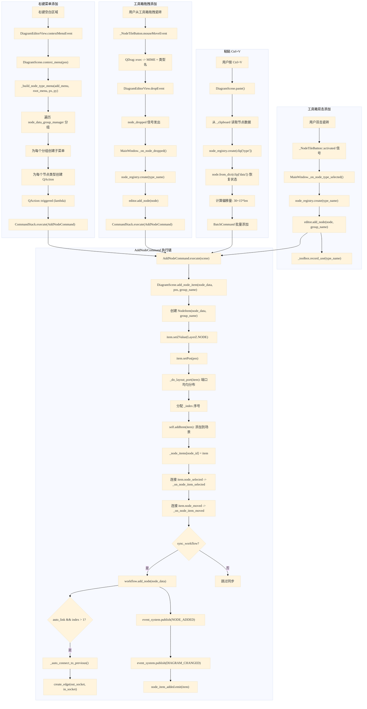

### 6.2 连线创建（完整拖拽状态机）

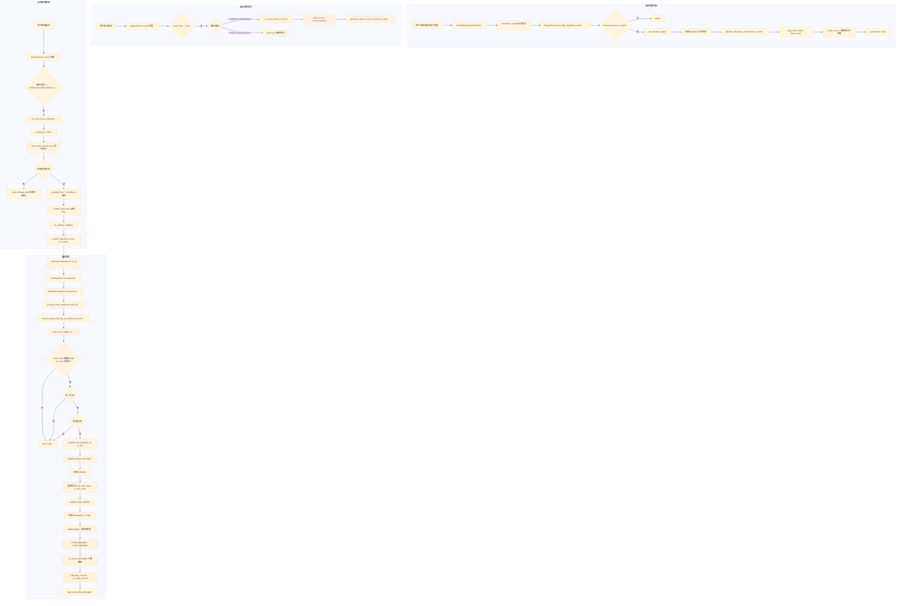

### 6.3 键盘快捷键

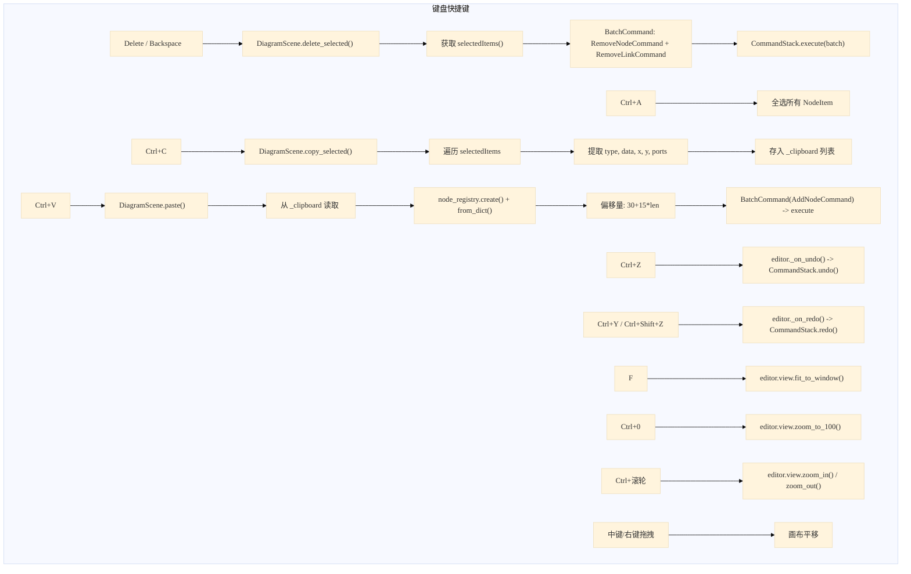

### 6.4 节点移动与对齐

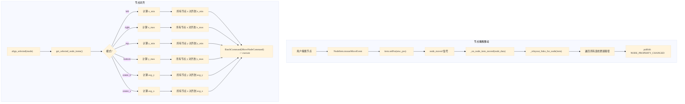

---

## 7. 工作流执行流程图（核心路径）

### 7.1 完整执行链

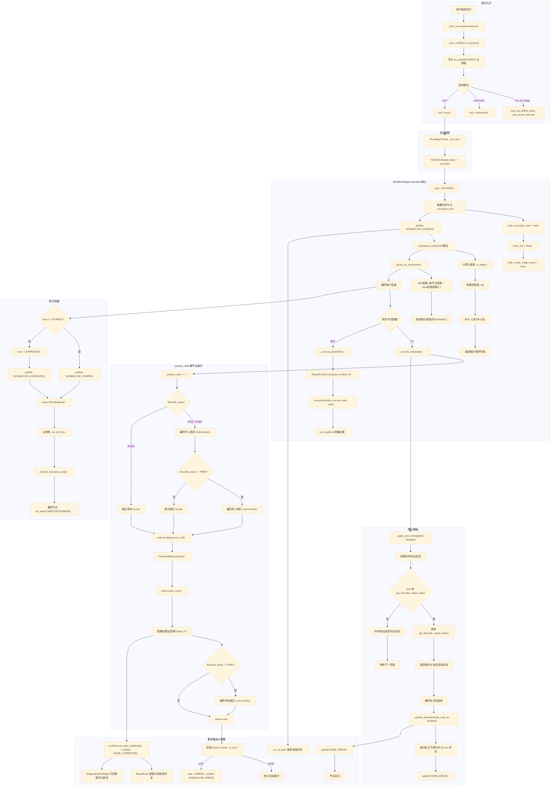

---

## 8. 起始页流程图

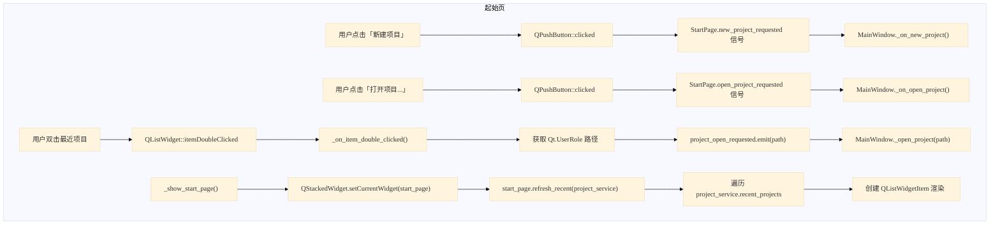

---

## 9. 工具箱面板流程图

```mermaid
%%{init: {"theme":"base", "themeVariables": {"fontSize":"16px","fontFamily":"Microsoft YaHei, sans-serif"}}}%%
graph TD
    subgraph ViewMode["视图模式"]
        TP1["搜索框 textChanged"] --> TP2["refresh() 过滤节点"]
        TP2 --> TP3["_all_node_metas(): 搜索过滤+收藏+最近使用排序"]

        TP4["视图切换 toggle"] --> TP5["FontIconToggleButton::toggled"]
        TP5 --> TP6["_on_view_toggled(checked)"]
        TP6 --> TP7["_save_view_mode()"]
        TP6 --> TP8["_apply_view()"]
        TP8 --> TP9{"宽度 < 阈值?"}
        TP9 -->|"是"| TP10["窄模式: _NarrowGroupButton 图标按钮弹窗"]
        TP9 -->|"否 树形"| TP11["_DraggableTreeWidget"]
        TP9 -->|"否 网格"| TP12["_CollapsibleGroup 折叠分组"]
    end

    subgraph GridInteraction["网格交互"]
        GV1["单击瓷砖"] --> GV2["_NodeTileButton::selected 信号"]
        GV2 --> GV3["_set_selected_type(type_name)"]
        GV4["双击瓷砖"] --> GV5["_NodeTileButton::activated 信号"]
        GV5 --> GV6["MainWindow._on_node_type_selected()"]
        GV7["拖拽瓷砖"] --> GV8["mouseMoveEvent -> QDrag::exec"]
        GV8 --> GV9["MIME 数据 = type_name"]
    end

    subgraph TreeInteraction["树形交互"]
        TV1["单击树项"] --> TV2["_on_tree_item_clicked()"]
        TV3["拖拽树项"] --> TV4["_DraggableTreeWidget.mimeData()"]
        TV4 --> TV5["封装 type_name 到 QMimeData"]
    end

    subgraph NarrowInteraction["窄模式交互"]
        NW1["点击分组图标"] --> NW2["_NarrowGroupButton::toggled"]
        NW2 --> NW3["_NarrowGroupPopup 弹出"]
        NW3 --> NW4["_DraggableCard 可选/拖拽"]
        NW4 --> NW5["activated / drag 信号"]
    end
```

---

## 10. 属性面板与设置对话框流程图

```mermaid
%%{init: {"theme":"base", "themeVariables": {"fontSize":"16px","fontFamily":"Microsoft YaHei, sans-serif"}}}%%
graph TD
    subgraph SettingsDialogFlow["设置对话框"]
        SET1["用户点击「设置」"] --> SET2["_SettingsDialog(parent=self)"]
        SET2 --> SET3["_setup_ui()"]
        SET3 --> SET4["_build_theme_tab()"]
        SET4 --> SET4a["_make_nav_box: Splitter+ListWidget+StackedWidget"]
        SET4a --> SET4b["遍历 theme_manager.available_themes"]
        SET4b --> SET4c["按分组: 强力推荐/纯色/外部主题"]
        SET4c --> SET4d["_make_theme_card(tdef): 200x100 QFrame"]
        SET4d --> SET4e["card.mousePressEvent = lambda -> _on_theme_select(tid)"]
        SET3 --> SET5["_build_basic_tab()"]
        SET5 --> SET5a["QCheckBox x3: auto_start / tray / theme_btn"]
        SET3 --> SET6["_build_display_tab()"]
        SET6 --> SET6a["QCheckBox x1: show_grid"]
        SET3 --> SET7["按钮行: 恢复默认 / 取消 / 确定"]
        SET7 --> SET7a["restore_btn.clicked -> _on_restore_default"]
        SET7 --> SET7b["cancel_btn.clicked -> _on_cancel"]
        SET7 --> SET7c["ok_btn.clicked -> accept()"]
        SET2 --> SET8["_load_settings()"]
        SET8 --> SET8a["从 app_config.json 加载"]
        SET8a --> SET8b["设置各 CheckBox 状态"]
        SET2 --> SET9["dialog.exec_()"]

        SET9 -->|"确定"| SET10["accept()"]
        SET10 --> SET10a["_save_settings()"]
        SET10a --> SET10b["构建 data 字典"]
        SET10b --> SET10c["json.dump 写入 app_config.json"]

        SET9 -->|"取消"| SET11["_on_cancel()"]
        SET11 --> SET11a["恢复原主题 theme_manager.set_theme()"]
        SET11a --> SET11b["_load_settings() 重新加载"]
        SET11b --> SET11c["dialog.reject()"]

        SET9 -->|"恢复默认"| SET12["_on_restore_default()"]
        SET12 --> SET12a["重置所有 CheckBox 为默认值"]
        SET12a --> SET12b["恢复原主题"]
    end

    subgraph PropertyPanelFlow["属性面板"]
        PP1["选中节点"] --> PP2["_select_node(node)"]
        PP2 --> PP3["_property_panel.set_node(node)"]
        PP3 --> PP4["PropertyPanel: 根据节点类型动态生成编辑器"]
        PP3 --> PP5["_help_panel.set_node(node)"]
        PP3 --> PP6["_result_panel.show_node_results(node)"]
        PP3 --> PP7["_update_image_context(node)"]
        PP4["属性修改"] --> PP8["property_changed.emit(name, old, new)"]
        PP8 --> PP9["MainWindow._on_property_changed()"]
        PP9 --> PP10["event_system.publish(NODE_PROPERTY_CHANGED)"]
    end
```

---

## 11. 事件系统流程图

```mermaid
%%{init: {"theme":"base", "themeVariables": {"fontSize":"16px","fontFamily":"Microsoft YaHei, sans-serif"}}}%%
graph TD
    subgraph EventSystemArch["EventSystem 架构"]
        EVT["core/events.py: EventSystem 全局单例"] --> EVT1["subscribe(event_type, handler)"]
        EVT1 --> EVT1a["_handlers[event_type].append(handler)"]
        EVT --> EVT2["publish(event_type, sender, **kwargs)"]
        EVT2 --> EVT2a["遍历 _handlers[event_type]"]
        EVT2a --> EVT2b["handler(sender, **kwargs)"]
        EVT2b --> EVT2c{"handler 抛出异常?"}
        EVT2c -->|"是"| EVT2d["publish MESSAGE_ERROR 继续其他 handler"]
        EVT2c -->|"否"| EVT2e["完成"]
        EVT --> EVT3["unsubscribe(event_type, handler)"]
    end

    subgraph Publishers["事件发布者"]
        EP1["WorkflowEngine"] -->|"WORKFLOW_STARTED / COMPLETED / STOPPED / ERROR"| EVT
        EP1 -->|"NODE_ADDED / NODE_REMOVED"| EVT
        EP1 -->|"LINK_ADDED / LINK_REMOVED"| EVT
        EP1 -->|"NODE_COMPLETED (via on_node_completed)"| EVT
        EP1 -->|"NODE_ERROR (via _apply_port_routing)"| EVT
        EP2["DiagramScene"] -->|"NODE_ADDED / NODE_REMOVED"| EVT
        EP2 -->|"LINK_ADDED / LINK_REMOVED"| EVT
        EP2 -->|"NODE_SELECTED / NODE_DESELECTED"| EVT
        EP2 -->|"DIAGRAM_CHANGED"| EVT
        EP2 -->|"NODE_PROPERTY_CHANGED"| EVT
        EP3["WorkflowRunner"] -->|"FILE_ITERATION_NEXT / COMPLETED"| EVT
        EP3 -->|"MESSAGE_ERROR"| EVT
        EP4["MainWindow"] -->|"NODE_PROPERTY_CHANGED"| EVT
    end

    subgraph Subscribers["事件订阅者"]
        ES1["MainWindow._connect_events()"]
        ES1 -.->|"NODE_SELECTED -> _on_ev_node_sel"| EVT
        ES1 -.->|"DIAGRAM_CHANGED -> _on_ev_diag_chg"| EVT
        ES1 -.->|"WORKFLOW_STARTED -> _on_wf_start"| EVT
        ES1 -.->|"WORKFLOW_COMPLETED -> _on_wf_done"| EVT
        ES1 -.->|"WORKFLOW_ERROR -> _on_wf_err"| EVT
        ES1 -.->|"WORKFLOW_STOPPED -> _on_wf_stopped"| EVT
        ES1 -.->|"PROJECT_LOADED -> _on_proj_load"| EVT
        ES1 -.->|"PROJECT_SAVED -> _on_proj_save"| EVT
        ES1 -.->|"FILE_ITERATION_NEXT -> _on_file_iteration_next"| EVT
        ES1 -.->|"FILE_ITERATION_COMPLETED -> _on_file_iteration_completed"| EVT

        ES2["DiagramEditorWidget"]
        ES2 -.->|"NODE_STARTED / COMPLETED / ERROR"| EVT
        ES2 -.->|"WORKFLOW_STOPPED"| EVT
        ES2 -.->|"LINK_STARTED / COMPLETED"| EVT
        ES2 -.->|"PORT_STARTED / COMPLETED"| EVT

        ES3["ResultPanel"]
        ES3 -.->|"NODE_COMPLETED / NODE_ERROR -> 同步历史"| EVT
    end
```

---

## 12. 连续执行帧率控制

```mermaid
%%{init: {"theme":"base", "themeVariables": {"fontSize":"16px","fontFamily":"Microsoft YaHei, sans-serif"}}}%%
graph TD
    subgraph ContinuousLoop["后台循环 _run_continuous"]
        CR1["while not _stop_event.is_set():"] --> CR2["记录 t_start = time.time()"]
        CR2 --> CR3["workflow.start() 全流程执行"]
        CR3 --> CR4["WorkflowEngine.start() -> execute()"]
        CR4 --> CR5{"result.is_error?"}
        CR5 -->|"是"| CR6["publish MESSAGE_ERROR + break"]
        CR5 -->|"否"| CR7["获取起始节点"]
        CR7 --> CR8["获取 target_ms = invoke_milliseconds_delay"]
        CR8 --> CR9["elapsed_ms = (now - t_start) * 1000"]
        CR9 --> CR10["remain_ms = target_ms - elapsed_ms"]
        CR10 --> CR11{"remain_ms > 0?"}
        CR11 -->|"是"| CR12["_stop_event.wait(remain_ms/1000)"]
        CR11 -->|"否"| CR1
        CR12 --> CR1
    end

    subgraph LivePreview["主线程实时预览"]
        CR13["_live_preview_timer 50ms"] --> CR14["_tick_live_preview()"]
        CR14 --> CR15{"_selected_node && _continuous_mode?"}
        CR15 -->|"是"| CR16{"node.mat 存在?"}
        CR16 -->|"是"| CR17["_img_panel.set_image(node.mat)"]
        CR16 -->|"否"| CR18{"_result_image_source?"}
        CR18 -->|"是"| CR19["_img_panel.set_image(result_image)"]
        CR15 -->|"否"| CR20["timer.stop()"]
        CR18 -->|"否"| CR21["不做任何操作"]
    end
```

---

## 13. 运行全部模式

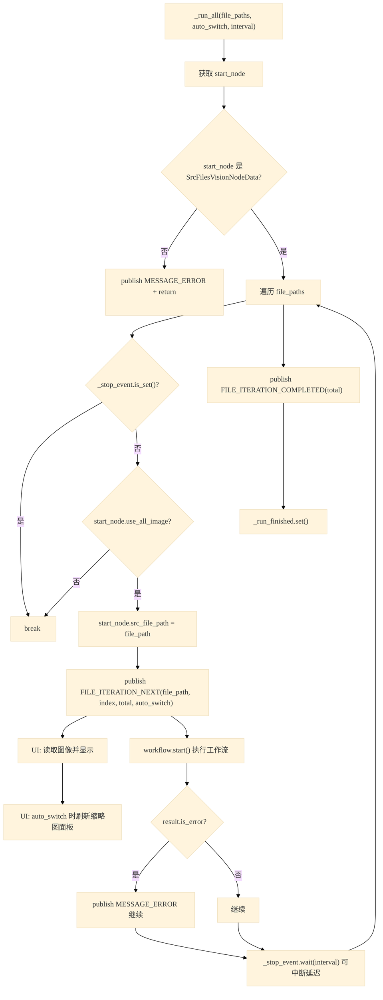

---

## 14. UI控件与信号槽完整清单

### 14.1 QPushButton / FontIconButton (工具栏) -- 共 24 个

| 控件 | 提示文本 | 信号 | 槽函数 | 所在文件 |
|------|---------|------|--------|----------|
| FontIconButton(Page) | 新建项目 | clicked | `_on_new_project` | main_window.py:1401 |
| FontIconButton(OpenFolder) | 打开项目 | clicked | `_on_open_project` | main_window.py:1396 |
| FontIconButton(Edit) | 编辑项目 | clicked | `_on_edit_project` | main_window.py:1397 |
| FontIconButton(Save) | 保存项目 | clicked | `_on_save_project` | main_window.py:1398 |
| FontIconButton(Add) | 新建流程图 | clicked | `_on_add_diagram` | main_window.py:1422 |
| FontIconButton(Ethernet) | 运行模式 | clicked | `_on_cycle_run_mode` | main_window.py:1423 |
| FontIconButton(Copy) | 重复流程图 | clicked | `_on_duplicate_diagram` | main_window.py:1424 |
| FontIconButton(DictionaryAdd) | 从模板添加 | clicked | `_on_add_from_template` | main_window.py:1425 |
| FontIconButton(Manage) | 模板管理 | clicked | `_on_manage_templates` | main_window.py:1426 |
| FontIconButton(SaveAs) | 另存为模板 | clicked | `_on_save_as_template` | main_window.py:1427 |
| FontIconButton(Cancel) | 删除流程图 | clicked | `_on_delete_diagram` | main_window.py:1428 |
| FontIconButton(Replay) | 单次执行 | clicked | `_on_run_workflow` | main_window.py:1459 |
| FontIconButton(Sync) | 连续执行 | clicked | `_on_continuous_run` | main_window.py:1460 |
| FontIconButton(Location) | 停止 | clicked | `_on_stop_workflow` | main_window.py:1461 |
| FontIconButton(Refresh) | 重置 | clicked | `_on_reset_workflow_view` | main_window.py:1462 |
| FontIconButton(Color) | 颜色主题 | clicked | `_on_show_theme_dialog` | main_window.py:1515 |
| FontIconButton(Setting) | 设置 | clicked | `_on_open_settings` | main_window.py:1516 |
| FontIconButton(Info) | 关于 | clicked | `_on_about` | main_window.py:1546 |
| FontIconButton(Smartcard) | 新手向导 | clicked | `_on_open_guide` | main_window.py:1547 |
| QPushButton(ChromeMinimize) | 最小化 | clicked | `self.showMinimized` | main_window.py:1582 |
| QPushButton(ChromeMaximize) | 最大化 | clicked | `_toggle_max` | main_window.py:1583 |
| QPushButton(ChromeRestore) | 还原 | clicked | `_toggle_max` | main_window.py:1584 |
| QPushButton(ChromeClose) | 关闭 | clicked | `_on_close_window` | main_window.py:1585 |
| QPushButton("▼") | 切换底部面板 | clicked | `_toggle_bottom` | main_window.py:1979 |

### 14.2 FontIconToggleButton -- 2 个

| 控件 | 提示文本 | 信号 | 槽函数 | 所在文件 |
|------|---------|------|--------|----------|
| FontIconToggleButton(Brightness/QuietHours) | 切换明暗 | toggled | `lambda: _on_toggle_theme()` | main_window.py:1529 |
| FontIconToggleButton (视图切换) | 树形/网格 | toggled | `_on_view_toggled` | toolbox_panel.py |

### 14.3 QAction (菜单栏) -- 15 个

| 菜单 | 动作 | 快捷键 | 信号 | 槽函数 | 所在文件 |
|------|------|--------|------|--------|----------|
| 文件 | 新建项目 | Ctrl+N | triggered | `_on_new_project` | main_window.py:2202 |
| 文件 | 打开项目 | Ctrl+O | triggered | `_on_open_project` | main_window.py:2203 |
| 文件 | 保存项目 | Ctrl+S | triggered | `_on_save_project` | main_window.py:2204 |
| 文件 | 另存为 | Ctrl+Shift+S | triggered | `_on_save_as_project` | main_window.py:2205 |
| 文件 | 退出 | Alt+F4 | triggered | `_on_close_window` | main_window.py:2211 |
| 编辑 | 撤销 | Ctrl+Z | triggered | `_on_undo_diagram` | main_window.py:2215 |
| 编辑 | 重做 | Ctrl+Y | triggered | `_on_redo_diagram` | main_window.py:2216 |
| 运行 | 运行流程 | F5 | triggered | `_on_run_workflow` | main_window.py:2220 |
| 运行 | 停止 | Shift+F5 | triggered | `_on_stop_workflow` | main_window.py:2221 |
| 系统 | 项目属性 | - | triggered | `_on_edit_project` | main_window.py:2225 |
| 系统 | 切换左侧面板 | - | triggered | `toggle_left_panel` | main_window.py:2227 |
| 系统 | 切换右侧面板 | - | triggered | `toggle_right_panel` | main_window.py:2228 |
| 帮助 | 使用指南 | - | triggered | `_on_open_guide` | main_window.py:2232 |
| 帮助 | 关于 | - | triggered | `_on_about` | main_window.py:2234 |
| 最近项目(动态) | 各项目路径 | - | triggered | `lambda: _open_project(path)` | main_window.py:2258 |

### 14.4 QMenu (上下文菜单)

| 事件 | 信号 | 处理函数 | 所在文件 |
|------|------|----------|----------|
| 右键空白区域 | - | `DiagramScene.context_menu(pos)` | scene.py |
| 右键菜单->添加节点->分组->QAction | triggered | `lambda: CommandStack.execute(AddNodeCommand(...))` | scene.py |
| 最近项目菜单 | aboutToShow | `_refresh_recent` | main_window.py:2209 |

### 14.5 QCheckBox (设置对话框) -- 4 个

| 控件变量 | 标签 | 属性键 | 所在文件 |
|----------|------|--------|----------|
| `_chk_auto_start` | 开机自动启动 | `auto_start` | main_window.py:756 |
| `_chk_tray` | 任务栏显示图标 | `show_tray` | main_window.py:759 |
| `_chk_theme_btn` | 显示主题按钮 | `show_theme_btn` | main_window.py:762 |
| `_chk_show_grid` | 显示画布网格 | `show_grid` | main_window.py:797 |

### 14.6 QLineEdit -- 2 个

| 控件 | 信号 | 处理 | 所在文件 |
|------|------|------|----------|
| 搜索框 (工具箱) | textChanged | `refresh()` | toolbox_panel.py |
| 流程图名称编辑框 | editingFinished | `_emit_rename() -> rename_requested` | main_window.py:459 |

### 14.7 QListWidget -- 3 个

| 控件 | 信号 | 处理 | 所在文件 |
|------|------|------|----------|
| 起始页最近项目列表 | itemDoubleClicked | `_on_item_double_clicked -> project_open_requested` | start_page.py:195 |
| 设置对话框导航列表 | currentRowChanged | `stack.setCurrentIndex` | main_window.py:595 |
| 模板列表 | itemDoubleClicked | 选择模板 | template_dialog.py |

### 14.8 QGraphicsItem 相关信号 -- 3 种

| 控件 | 信号 | 处理 | 所在文件 |
|------|------|------|----------|
| NodeItem | node_selected | `_on_node_item_selected -> emit node_selected` | node_item.py |
| NodeItem | node_moved | `_on_node_item_moved -> _relayout_links_for_node` | node_item.py |
| EdgeItem | edge_selected | `_on_edge_selected` | edge_item.py |
| SocketItem | connection_started | `DiagramScene.start_edge_drag` | socket_item.py |

### 14.9 QTimer -- 4 个

| 定时器 | 间隔 | 超时处理 | 用途 | 所在文件 |
|--------|------|----------|------|----------|
| `_clock` | 1000ms | `_update_clock` | 更新状态栏时间显示 | main_window.py:964 |
| `_live_preview_timer` | 50ms | `_tick_live_preview` | 连续执行时实时刷新图像 | main_window.py:927 |
| `_commit_timer` | 0ms (单次) | `_do_pending_commit` | 延迟提交连线创建 | scene.py |
| `QTimer.singleShot(50ms)` | 50ms (单次) | `_poll_execution_finished._check` | 轮询执行完成状态 | main_window.py:3559 |

### 14.10 QThread -- 3 个后台线程

| 线程 | 目标函数 | 启动方式 | 所在文件 |
|------|----------|----------|----------|
| `_thread` (daemon) | `_run_once` | `start_once()` | workflow_runner.py:92 |
| `_thread` (daemon) | `_run_all` | `start_run_all()` | workflow_runner.py:121 |
| `_thread` (daemon) | `_run_continuous` | `start_continuous()` | workflow_runner.py:143 |

### 14.11 pyqtSignal (自定义信号) -- 17 个

| 信号名 | 参数 | 发出者 | 接收者 | 所在文件 |
|--------|------|--------|--------|----------|
| `_wf_ui_update` | str, dict | `_on_wf_start/_done/_err/_stopped` | `_on_wf_ui_update` | main_window.py:892 |
| `node_item_added` | NodeItem | `DiagramScene.add_node_item` | `DiagramEditorWidget` | scene.py |
| `node_item_removed` | str | `DiagramScene.remove_node_item` | `DiagramEditorWidget` | scene.py |
| `edge_item_added` | EdgeItem | `DiagramScene.create_edge` | `DiagramEditorWidget` | scene.py |
| `edge_item_removed` | str | `DiagramScene.remove_edge_item` | `DiagramEditorWidget` | scene.py |
| `node_selected` | object | `DiagramScene._on_node_item_selected` | `MainWindow._on_editor_node_selected` | scene.py |
| `node_deselected` | - | `DiagramScene._on_selection_changed` | `MainWindow._select_node(None)` | scene.py |
| `status_message` | str | `DiagramScene` 多处 | `MainWindow._on_editor_status` | scene.py |
| `new_project_requested` | - | `StartPage` | `MainWindow._on_new_project` | start_page.py:29 |
| `open_project_requested` | - | `StartPage` | `MainWindow._on_open_project` | start_page.py:31 |
| `project_open_requested` | str | `StartPage` | `MainWindow._open_project` | start_page.py:33 |
| `rename_requested` | str | `_DiagramTabHeader` | `MainWindow._rename_diagram` | main_window.py:426 |
| `node_type_selected` | str | `ToolboxPanel` | `MainWindow._on_node_type_selected` | toolbox_panel.py |
| `property_changed` | name, old, new | `PropertyPanel` | `MainWindow._on_property_changed` | property_panel.py |
| `node_jump_requested` | str | `ResultPanel` | `MainWindow._jump_to_node` | result_panel.py |
| `image_update_requested` | image | `ResultPanel` | `MainWindow._on_result_image_update` | result_panel.py |
| `file_selected` | str | `FlowResourcePanel` | `MainWindow._on_resource_file_selected` | flow_resource_panel.py |
| `file_double_clicked` | str | `FlowResourcePanel` | `MainWindow._on_resource_file_double_clicked` | flow_resource_panel.py |

### 14.12 EventSystem 事件订阅 -- 22 个事件

| 事件类型 | 发布者 | 订阅者函数 | 所在文件 |
|----------|--------|------------|----------|
| NODE_SELECTED | DiagramScene | `_on_ev_node_sel` | main_window.py:2095 |
| NODE_DESELECTED | DiagramScene | 内置逻辑 | scene.py |
| DIAGRAM_CHANGED | DiagramScene, WorkflowEngine | `_on_ev_diag_chg` | main_window.py:2097 |
| WORKFLOW_STARTED | WorkflowEngine | `_on_wf_start` -> emit `_wf_ui_update("start")` | main_window.py:2099 |
| WORKFLOW_COMPLETED | WorkflowEngine | `_on_wf_done` -> emit `_wf_ui_update("done")` | main_window.py:2101 |
| WORKFLOW_ERROR | WorkflowEngine | `_on_wf_err` -> emit `_wf_ui_update("error")` | main_window.py:2103 |
| WORKFLOW_STOPPED | WorkflowEngine | `_on_wf_stopped` -> emit `_wf_ui_update("stopped")` | main_window.py:2105 |
| NODE_ADDED | DiagramScene, WorkflowEngine | 内置逻辑 | workflow.py:98 |
| NODE_REMOVED | DiagramScene, WorkflowEngine | 内置逻辑 | workflow.py:117 |
| LINK_ADDED | WorkflowEngine | 内置逻辑 | workflow.py:330 |
| LINK_REMOVED | DiagramScene, WorkflowEngine | 内置逻辑 | workflow.py:370 |
| NODE_PROPERTY_CHANGED | MainWindow, DiagramScene | 内置逻辑 | main_window.py:3120 |
| NODE_COMPLETED | WorkflowEngine | ResultPanel, DiagramEditorWidget | workflow.py |
| NODE_ERROR | WorkflowEngine | ResultPanel, DiagramEditorWidget | workflow.py |
| PROJECT_LOADED | ProjectService | `_on_proj_load` | main_window.py:2107 |
| PROJECT_SAVED | ProjectService | `_on_proj_save` | main_window.py:2109 |
| FILE_ITERATION_NEXT | WorkflowRunner | `_on_file_iteration_next` | main_window.py:2111 |
| FILE_ITERATION_COMPLETED | WorkflowRunner | `_on_file_iteration_completed` | main_window.py:2112 |
| MESSAGE_ERROR | WorkflowRunner, WorkflowEngine | 日志面板 | workflow_runner.py:175 |

---

## 15. 函数调用表

### 15.1 主窗口槽函数表 (main_window.py)

| 函数 | 作用 | 输入 | 输出 | 调用者 |
|------|------|------|------|--------|
| `_on_new_project` | 创建新项目并绑定 | 无 | 无 | 按钮clicked / 菜单Action / StartPage信号 |
| `_on_open_project` | 打开项目文件对话框 | 无 | 无 | 按钮clicked / 菜单Action / StartPage信号 |
| `_open_project` | 加载项目文件 | path: str | 无 | `_on_open_project` / StartPage / 最近项目 |
| `_on_save_project` | 保存当前项目 | 无 | 无 | 按钮clicked / 菜单Action |
| `_on_save_as_project` | 另存为项目 | 无 | 无 | 菜单Action / `_on_save_project` |
| `_on_edit_project` | 编辑项目属性 | 无 | 无 | 按钮clicked / 菜单Action |
| `_on_add_diagram` | 新建流程图 | 无 | 无 | 按钮clicked |
| `_on_duplicate_diagram` | 复制当前流程图 | 无 | 无 | 按钮clicked |
| `_on_add_from_template` | 从模板创建流程图 | 无 | 无 | 按钮clicked |
| `_on_manage_templates` | 打开模板管理对话框 | 无 | 无 | 按钮clicked |
| `_on_save_as_template` | 保存流程图为模板 | 无 | 无 | 按钮clicked |
| `_on_delete_diagram` | 删除当前流程图 | 无 | 无 | 按钮clicked / 标签页关闭按钮 |
| `_on_cycle_run_mode` | 切换运行模式 | 无 | 无 | 按钮clicked |
| `_on_run_workflow` | 启动单次执行 | 无 | 无 | 按钮clicked / 菜单Action |
| `_on_continuous_run` | 启动连续执行 | 无 | 无 | 按钮clicked |
| `_start_execution` | 统一执行入口 | continuous: bool | 无 | `_on_run_workflow` / `_on_continuous_run` |
| `_on_stop_workflow` | 停止当前执行 | 无 | 无 | 按钮clicked / 菜单Action |
| `_on_reset_workflow_view` | 重置工作流视图 | 无 | 无 | 按钮clicked |
| `_on_undo_diagram` | 撤销图表操作 | 无 | 无 | 按钮clicked / 菜单Action / Ctrl+Z |
| `_on_redo_diagram` | 重做图表操作 | 无 | 无 | 按钮clicked / 菜单Action / Ctrl+Y |
| `_on_show_theme_dialog` | 打开主题选择对话框 | 无 | 无 | 按钮clicked |
| `_on_toggle_theme` | 切换明暗主题 | 无 | 无 | FontIconToggleButton::toggled |
| `_on_open_settings` | 打开设置对话框 | 无 | 无 | 按钮clicked |
| `_on_about` | 显示关于对话框 | 无 | 无 | 按钮clicked / 菜单Action |
| `_on_open_guide` | 打开使用指南 | 无 | 无 | 按钮clicked / 菜单Action |
| `_on_close_window` | 关闭窗口 | 无 | 无 | 按钮clicked / 菜单Action |
| `_select_node` | 选中节点并更新所有面板 | node: NodeBase | 无 | 多个信号 |
| `_on_node_type_selected` | 工具箱选中节点类型 | type_name: str | 无 | ToolboxPanel信号 |
| `_on_editor_node_selected` | 编辑器节点选中 | node_data: NodeBase | 无 | DiagramEditorWidget信号 |
| `_on_editor_node_double_clicked` | 节点双击打开属性对话框 | node_data: NodeBase | 无 | DiagramEditorWidget信号 |
| `_on_node_executed` | 节点执行完成 | node_data, state, time_span | 无 | DiagramEditorWidget信号 |
| `_on_editor_node_help_requested` | 显示节点帮助 | node_data: NodeBase | 无 | DiagramEditorWidget信号 |
| `_on_editor_status` | 编辑器状态消息 | message: str | 无 | DiagramScene信号 |
| `_on_property_changed` | 属性变化通知 | name, old, new | 无 | PropertyPanel信号 |
| `toggle_left_panel` | 切换左侧面板 | 无 | 无 | 菜单Action |
| `toggle_right_panel` | 切换右侧面板 | 无 | 无 | 菜单Action |
| `_toggle_bottom` | 切换底部面板 | 无 | 无 | QPushButton::clicked |
| `_toggle_max` | 切换最大化/还原 | 无 | 无 | QPushButton::clicked / 双击标题栏 |
| `_tick_live_preview` | 实时预览刷新 | 无 | 无 | QTimer(50ms) |
| `_update_clock` | 更新状态栏时钟 | 无 | 无 | QTimer(1000ms) |
| `_on_wf_ui_update` | 工作流UI更新(跨线程) | event: str, data: dict | 无 | pyqtSignal `_wf_ui_update` |
| `_finalize_execution_state` | 执行完成后最终化节点状态 | 无 | 无 | `_poll_execution_finished` / `_on_wf_ui_update` |
| `_poll_execution_finished` | 轮询后台线程完成状态 | 无 | 无 | `_start_execution` |
| `_sync_workflow_to_project` | 同步场景状态到项目数据 | 无 | 无 | 保存/执行/切换前调用 |
| `_apply_theme` | 应用主题到所有控件 | 无 | 无 | theme_changed信号 / 设置变更 |
| `_apply_settings` | 应用持久化设置到UI | 无 | 无 | 启动/设置变更 |
| `_refresh_command_states` | 更新工具栏按钮启用状态 | project: ProjectItem | 无 | 多处调用 |
| `_refresh_diagram_tabs` | 刷新图表标签页列表 | project: ProjectItem | 无 | 项目变更时调用 |
| `_bind_project_diagram` | 绑定项目图表到UI | project: ProjectItem | 无 | 创建/加载项目时调用 |
| `_wire_diagram_editor` | 连接编辑器信号到主窗口 | editor: DiagramEditorWidget | 无 | `_create_diagram_page` |
| `_create_diagram_page` | 创建图表页面控件 | diagram: DiagramData | QWidget | `_refresh_diagram_tabs` |
| `_jump_to_node` | 跳转并选中指定节点 | node_id: str | 无 | ResultPanel信号 |
| `_rename_diagram` | 重命名图表 | diagram, text | 无 | _DiagramTabHeader信号 |

### 15.2 WorkflowEngine 核心函数表 (core/workflow.py)

| 函数 | 作用 | 输入 | 输出 | 调用者 |
|------|------|------|------|--------|
| `start` | 启动工作流执行 | 无 | FlowableResult | WorkflowRunner._run_once |
| `execute` | 核心执行: 拓扑排序+层级执行 | 无 | FlowableResult | `start` |
| `stop` | 停止执行 | 无 | 无 | WorkflowRunner.stop |
| `reset` | 重置状态为 IDLE | 无 | 无 | MainWindow._on_reset_workflow_view |
| `add_node` | 添加节点到工作流 | node: NodeBase | str (node_id) | DiagramScene.add_node_item |
| `remove_node` | 移除节点及相关连线 | node_id: str | 无 | DiagramScene.remove_node_item |
| `add_link` | 添加连线 | from_id, to_id, ports... | LinkData or None | DiagramScene.create_edge |
| `remove_link` | 移除连线 | link_id: str | 无 | DiagramScene.remove_edge_item |
| `topological_sort` | Kahn拓扑排序 | 无 | list[str] | `execute` |
| `_group_by_levels` | BFS距离分组 | topo_order: list[str] | list[list[str]] | `execute` |
| `_execute_node` | 执行单个节点 | node: NodeBase | FlowableResult | `execute` / `_execute_parallel` |
| `_execute_parallel` | 并行执行多个节点 | node_ids: list[str] | list[FlowableResult] | `execute` |
| `_apply_port_routing` | 条件分支路由 | node, disabled: set | 无 | `execute` |
| `_disable_downstream` | 递归禁用下游节点 | node_id, disabled: set | 无 | `_apply_port_routing` |
| `on_node_completed` | 记录节点完成消息 | node, state, time_span | 无 | VisionNodeData.invoke |
| `to_dict` | 序列化为字典 | 无 | dict | ProjectService.save |
| `from_dict` | 从字典加载 | data, node_factory | 无 | ProjectService.load |
| `can_start` | 判断是否可启动 | 无 | bool | MainWindow._refresh_command_states |
| `can_stop` | 判断是否可停止 | 无 | bool | MainWindow._refresh_command_states |
| `can_reset` | 判断是否可重置 | 无 | bool | MainWindow._refresh_command_states |
| `get_start_node_data` | 获取起始节点 | 无 | NodeBase or None | `start` / `_run_continuous` |

### 15.3 WorkflowRunner 函数表 (services/workflow_runner.py)

| 函数 | 作用 | 输入 | 输出 | 调用者 |
|------|------|------|------|--------|
| `start_once` | 后台线程执行一次 | 无 | 无 | MainWindow._start_execution |
| `start_run_all` | 遍历所有源文件执行 | file_paths, auto_switch, interval | 无 | MainWindow._start_execution |
| `start_continuous` | 循环执行直到停止 | 无 | 无 | MainWindow._start_execution |
| `stop` | 请求停止执行 | 无 | 无 | MainWindow._on_stop_workflow |
| `bind` | 绑定工作流引擎 | workflow: WorkflowEngine | 无 | `_on_diagram_tab_changed` |
| `_run_once` | 单次执行 (后台线程) | 无 | 无 | threading.Thread |
| `_run_all` | 遍历文件执行 (后台线程) | file_paths, auto_switch, interval | 无 | threading.Thread |
| `_run_continuous` | 帧率控制循环 (后台线程) | 无 | 无 | threading.Thread |

### 15.4 DiagramScene 核心函数表 (gui/node_editor/scene.py)

| 函数 | 作用 | 输入 | 输出 | 调用者 |
|------|------|------|------|--------|
| `add_node_item` | 添加节点到场景 | node_data, pos, group_name | NodeItem | AddNodeCommand.execute / paste / load_from_workflow |
| `remove_node_item` | 从场景移除节点 | node_id, sync_workflow | 无 | RemoveNodeCommand.execute / delete_selected |
| `create_edge` | 创建连线 | from_socket, to_socket | EdgeItem or None | AddLinkCommand.execute / _commit_edge |
| `remove_edge_item` | 移除连线 | link_id, sync_workflow | 无 | RemoveLinkCommand.execute |
| `start_edge_drag` | 开始连线拖拽 | from_socket | 无 | SocketItem.connection_started |
| `_commit_edge` | 通过命令栈提交连线 | from_socket, to_socket | 无 | `_do_pending_commit` |
| `context_menu` | 构建右键上下文菜单 | pos: QPointF | QMenu or None | DiagramEditorView.contextMenuEvent |
| `delete_selected` | 删除选中项 | 无 | 无 | 键盘Delete/Backspace |
| `copy_selected` | 复制选中节点到剪贴板 | 无 | 无 | 键盘Ctrl+C |
| `paste` | 粘贴剪贴板节点 | 无 | 无 | 键盘Ctrl+V |
| `undo` | 撤销 | 无 | 无 | 键盘Ctrl+Z |
| `redo` | 重做 | 无 | 无 | 键盘Ctrl+Y |
| `_do_layout_port` | 计算节点端口布局 | item: NodeItem | 无 | add_node_item |
| `_do_layout_link` | 计算连线路径 | edge: EdgeItem | 无 | create_edge / node_moved |
| `save_to_workflow` | 场景数据保存到工作流 | workflow: WorkflowEngine | 无 | `_sync_workflow_to_project` |
| `load_from_workflow` | 从工作流加载场景 | workflow: WorkflowEngine | 无 | `bind_workflow` |
| `get_all_node_items` | 获取所有节点图形项 | 无 | list[NodeItem] | `_finalize_execution_state` |
| `get_node_item` | 按ID获取节点图形项 | node_id: str | NodeItem or None | `_jump_to_node` |

### 15.5 CommandStack 函数表 (core/commands.py)

| 函数 | 作用 | 输入 | 输出 | 调用者 |
|------|------|------|------|--------|
| `execute` | 执行命令并入栈 | cmd: Command | Any | 场景操作 (添加/删除/移动) |
| `undo` | 撤销上一个命令 | 无 | bool | Ctrl+Z / 菜单 |
| `redo` | 重做被撤销的命令 | 无 | bool | Ctrl+Y / 菜单 |
| `clear` | 清空命令栈 | 无 | 无 | 重置/新建项目 |

### 15.6 EventSystem 函数表 (core/events.py)

| 函数 | 作用 | 输入 | 输出 | 调用者 |
|------|------|------|------|--------|
| `subscribe` | 订阅事件 | event_type, handler | 无 | MainWindow._connect_events |
| `publish` | 发布事件 | event_type, sender, **kwargs | 无 | 各模块 (WorkflowEngine/Scene/Runner等) |
| `unsubscribe` | 取消订阅 | event_type, handler | 无 | 清理时调用 |
| `clear` | 清空所有订阅 | 无 | 无 | 重置时调用 |

### 15.7 面板信号发射函数表

| 函数 | 所在文件 | 作用 | 发出的信号/事件 |
|------|----------|------|-----------------|
| `StartPage._on_item_double_clicked` | start_page.py | 双击最近项目 | `project_open_requested.emit(path)` |
| `StartPage.refresh_recent` | start_page.py | 刷新最近项目列表 | 无 (直接更新 UI) |
| `ToolboxPanel.refresh` | toolbox_panel.py | 过滤并刷新节点列表 | 无 |
| `ToolboxPanel.record_use` | toolbox_panel.py | 记录节点使用次数 | 无 |
| `PropertyPanel.set_node` | property_panel.py | 设置编辑目标节点 | 无 |
| `PropertyPanel.set_image_viewer` | property_panel.py | 绑定图像查看器 | 无 |
| `ResultPanel.bind_workflow` | result_panel.py | 绑定工作流到结果面板 | 无 |
| `ResultPanel.show_node_results` | result_panel.py | 显示节点执行结果 | 无 |
| `ResultPanel.sync_history_from_workflow` | result_panel.py | 从工作流同步历史记录 | 无 |
| `FlowResourcePanel.set_node` | flow_resource_panel.py | 设置当前源节点 | 无 |
| `FlowResourcePanel.refresh_selection` | flow_resource_panel.py | 刷新缩略图选中状态 | 无 |
| `ImageViewerPanel.set_image` | image_viewer.py | 设置显示图像 | 无 |
| `ImageViewerPanel.set_image_info` | image_viewer.py | 设置图像信息文本 | 无 |
| `LogPanel.info/warning/error/success` | log_panel.py | 记录日志消息 | 无 |

---

## 16. PlantUML 代码

### 16.1 总体架构时序图

```plantuml
@startuml
!theme aws-orange

title VisionFlow 系统架构 - 用户操作全流程

actor 用户

rectangle "GUI层" {
    [MainWindow] as MW
    [StartPage] as SP
    [ToolboxPanel] as TP
    [DiagramEditorWidget\n+Scene+View] as DEW
    [ImageViewer\nPropertyPanel\nResultPanel\nLogPanel] as PANELS
}

rectangle "服务层" {
    [WorkflowRunner\n后台线程] as WR
    [ProjectService\nJSON序列化] as PS
}

rectangle "核心引擎" {
    [WorkflowEngine\n拓扑排序+执行] as WE
    [EventSystem\n发布/订阅] as ES
    [CommandStack\n撤销/重做] as CS
}

rectangle "节点实现 100+" {
    [sources/preprocessings/\ndetectors/outputs/...] as NODES
}

== 启动 ==
用户 -> SP: 启动应用
SP -> MW: 新建/打开项目
MW -> PS: load/save JSON

== 编辑流程图 ==
用户 -> TP: 选择节点类型(树形/网格)
TP -> DEW: 拖拽/双击 -> AddNodeCommand
DEW -> CS: execute
CS -> WE: add_node 同步

== 连线 ==
用户 -> DEW: 从输出端口拖到输入端口
DEW -> CS: AddLinkCommand
CS -> WE: add_link

== 执行 ==
用户 -> MW: 点击运行(单次/连续/全部)
MW -> WR: start_once/continuous/run_all
WR -> WE: 后台线程 -> execute()
WE -> WE: 拓扑排序 -> 层级分组 -> 执行
WE -> NODES: node.invoke() 图像处理
WE -> ES: publish 状态事件
ES -> DEW: 更新节点颜色
WE -> MW: publish 完成事件

@enduml
```

### 16.2 工作流执行核心时序图

```plantuml
@startuml
!theme aws-orange

title 工作流执行核心时序图

actor 用户 as User
participant "MainWindow" as MW
participant "WorkflowRunner" as WR
participant "后台线程" as Thread
participant "WorkflowEngine" as WE
participant "VisionNodeData" as VND
participant "EventSystem" as ES
participant "DiagramEditorWidget" as DEW

User -> MW: 点击「单次执行」
activate MW

MW -> MW: _sync_workflow_to_project()
note right: 场景->数据持久化

MW -> MW: 所有节点 set_state(RUNNING)

MW -> WR: start_once()
activate WR

WR -> Thread: threading.Thread daemon
activate Thread

Thread -> WE: workflow.start() -> execute()
activate WE

WE -> WE: topological_sort()
note right: Kahn 拓扑排序算法

WE -> WE: _group_by_levels()
note right: BFS 距离分组

WE -> ES: publish WORKFLOW_STARTED
ES --> MW: _on_wf_start 更新UI

loop 每个层级
    WE -> WE: _execute_node / _execute_parallel
    WE -> VND: node.invoke(previors, self)
    activate VND
    VND -> VND: invoke_core()
    note right: 图像处理主逻辑
    deactivate VND

    WE -> ES: publish NODE_COMPLETED
    ES --> DEW: _on_node_completed
    activate DEW
    DEW -> DEW: set_state(COMPLETED)
    deactivate DEW

    WE -> WE: _apply_port_routing()
    note right: 条件分支路由
end

WE -> ES: publish WORKFLOW_COMPLETED
ES --> MW: _on_wf_done

WE --> Thread: FlowableResult
deactivate WE

Thread -> Thread: _run_finished.set()
deactivate Thread

MW -> MW: _poll_execution_finished 轮询
MW -> MW: _finalize_execution_state
note right: 最终化节点颜色

deactivate MW
deactivate WR

@enduml
```

### 16.3 节点添加流程 (PlantUML 活动图)

```plantuml
@startuml
!theme aws-orange

title 节点添加活动图

start

:用户触发添加节点;

split
    :右键菜单\ncontext_menu();
split again
    :工具箱拖拽\nQDrag::exec();
split again
    :双击瓷砖\nactivated信号;
split again
    :粘贴 Ctrl+V\npaste();
end split

:_build_node_type_menu/\ndropEvent/activated;

partition "CommandStack" {
    :执行 AddNodeCommand;
    :DiagramScene.add_node_item();
}

partition "场景渲染" {
    :创建 NodeItem 图形项\n设置 Z序 + 位置;
    :_do_layout_port()\n端口布局计算;
}

partition "同步" {
    :workflow.add_node()\n数据层同步;
    :event_system.publish\nNODE_ADDED;
    :event_system.publish\nDIAGRAM_CHANGED;
    :node_item_added 信号\n连接插座拖拽信号;
}

stop

@enduml
```

### 16.4 连线创建拖拽过程 (PlantUML 状态图)

```plantuml
@startuml
!theme aws-orange

title 连线创建拖拽状态机

state 空闲: 未拖拽
state 拖拽中: _connecting=True\n预览连线可见
state 提交: _commit_timer\n延迟0ms提交

[*] --> 空闲

空闲 --> 拖拽中: 用户从输出端口按下\nstart_edge_drag()
拖拽中 --> 拖拽中: 移动鼠标\n更新预览连线终点
拖拽中 --> 空闲: 释放到空白\n"连线已取消"
拖拽中 --> 提交: 释放到有效输入端口\n_commit_timer.start()
提交 --> 空闲: _commit_edge()\n创建 EdgeItem + LinkData

note right of 提交: AddLinkCommand -> create_edge()\nworkflow.add_link()\npublish LINK_ADDED

@enduml
```

### 16.5 启动流程 (PlantUML 活动图)

```plantuml
@startuml
!theme aws-orange

title 启动流程活动图

start

:python main.py;
:argparse 解析参数;

if (--cli 参数?) then (是)
    :run_cli(path);
    :setup_logging();
    :ProjectService.load();
    :WorkflowEngine.execute();
    :sys.exit();
    stop
else (否)
    :bootstrap_app_context();
    :AppContext.init_defaults();
    :_discover_nodes();
    note right: 遍历 nodes.* 包\n注册所有 NodeBase 子类
    :run_gui(ctx, project_path);
    :QApplication 创建;
    :Theme + StyleSheet 应用;
    :MainWindow.__init__;
    note right: _setup_window()\n_setup_caption_bar()\n_setup_main_surface()\n_setup_status_bar()\n_wire_signals()\n_connect_events()
    :window.show();
    if (--project 参数?) then (是)
        :window.open_project(path);
        :_bind_project_diagram();
    else (否)
        :_show_start_page();
    endif
    :app.exec_() 主事件循环;
    stop
endif

@enduml
```

---

> **生成说明**: 本文档通过对 VisionFlow 项目全部 140+ Python 源文件的系统性分析生成。
> 覆盖了所有 Qt 控件的信号/槽连接，包括：
> - **QPushButton / FontIconButton** (24个工具栏按钮 + 窗口控制按钮)
> - **QAction** (15个菜单动作 + 最近项目动态动作)
> - **QCheckBox** (4个: auto_start / tray / theme_btn / show_grid)
> - **QMenu** (5个子菜单: 文件/编辑/运行/系统/帮助) + 右键上下文菜单
> - **QGraphicsItem** (3种: NodeItem / EdgeItem / SocketItem)
> - **QTimer** (4个: _live_preview_timer(50ms) / _clock(1s) / _commit_timer(0ms) / singleShot(50ms)轮询)
> - **QThread** (3个: _run_once / _run_all / _run_continuous)
> - **FontIconToggleButton** (2个: 视图切换 / 明暗切换)
> - **QListWidget** (3个: 起始页最近项目 / 模板列表 / 设置导航)
> - **QLineEdit** (2个: 搜索框 / 流程图重命名)
> - **QTabWidget** (2个: 流程图多标签 / 中央标签页)
> - **QStackedWidget** (2个: 起始页/编辑器切换 / 设置导航)
> - **QSplitter** (3个: 左右分割 / 上下分割 / 设置导航)
>
> 以及 connect()、lambda、emit、EventSystem.publish/subscribe、ThreadPoolExecutor 等调用链的完整追溯。
> 所有 Mermaid 图表已配置 `fontSize: 16px` 以放大字体，确保清晰可读。
